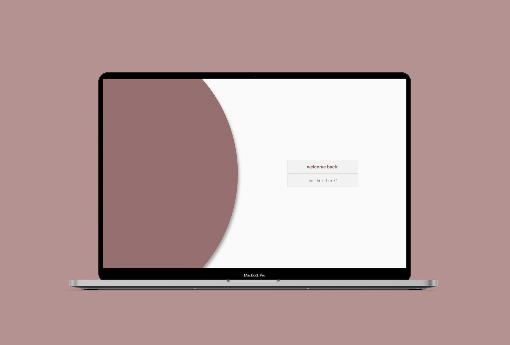
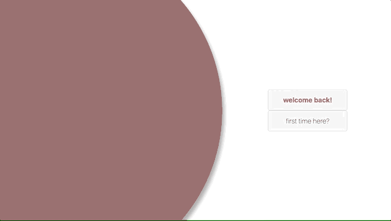

#Project Management App

**App for managing small sized projects**

[Explore the docs »](https://github.com/almarina91/project-management-frontend)

[View demo](https://almarina91pm.github.io.) *

*please allow some time for server to respond, since the app is hosted on Heroku free tier.*


<!-- ABOUT THE PROJECT -->
## About The Project
A desktop solution for managing small projects.

Projects are used to organize tasks into logical units. Tasks are used as a child of Project. One task can belong to one Project, and one project can have many tasks.
Available roles for the users are Administrator, Project Manager and Developer.




### Built With

* [MongoDB]()
* [Express]()
* [React]()
* [Node.js]()


<!-- GETTING STARTED -->
## Getting Started

To get a local copy up and running follow these simple steps.

### Prerequisites

This is an example of how to list things you need to use the software and how to install them.
* npm
  ```sh
  npm install npm@latest -g
  ```

### Installation

1. Clone the repo
   ```sh
   git clone https://github.com/almarina91/project-management-frontend.git
   ```
2. Install NPM packages
   ```sh
   npm install
   ```


<!-- USAGE EXAMPLES -->
## Usage
Projects are used to organise tasks into logical units. Users can have one of the three roles: Administrator, Project Manager and Developer.
 A system for tracking Tasks and User assignments is administered by the Administrator, who is allowed to do any of the scenarios defined below.
Scenarios:

● All Users use the same login form.

● Administrator can view, create, modify and delete Projects, Tasks and Users. He can also assign / unassign a Task to a User.

● Project Managers can create Projects, Tasks and assign Tasks to the Developers.

● User can modify Task only if it is assigned to him / her. User with Developer role is allowed to change: status, progress, description. User with Project Manager role is allowed to change: assignee, status, progress, deadline,
description. User can view only tasks that are assigned to him / her or are not assigned to anyone.

● Project manager can view a list of projects and their progress. Project progress is based on progress
of all project tasks. (e.g. project with three tasks with progress 0%, 50% and 100% has progress 50%)



<!-- ROADMAP -->
## Roadmap

See the [open issues](https://github.com/almarina91/project-management-frontend/issues) for a list of proposed features (and known issues).


<!-- CONTRIBUTING -->
## Contributing

Contributions are what make the open source community such an amazing place to be learn, inspire, and create. Any contributions you make are **greatly appreciated**.

1. Fork the Project
2. Create your Feature Branch (`git checkout -b feature/AmazingFeature`)
3. Commit your Changes (`git commit -m 'Add some AmazingFeature'`)
4. Push to the Branch (`git push origin feature/AmazingFeature`)
5. Open a Pull Request


<!-- LICENSE -->
## License

Distributed under the MIT License. See `LICENSE` for more information.


<!-- CONTACT -->
## Contact

Marina Grujic - almarina91@gmail.com

Project Link: [https://github.com/almarina91/project-management-frontend](https://github.com/almarina91/project-management-frontend)


<!-- MARKDOWN LINKS & IMAGES -->
<!-- https://www.markdownguide.org/basic-syntax/#reference-style-links -->
[contributors-shield]: https://img.shields.io/github/contributors/almarina91/repo.svg?style=for-the-badge
[contributors-url]: https://github.com/almarina91/project-management-frontend/graphs/contributors
[forks-shield]: https://img.shields.io/github/forks/almarina91/repo.svg?style=for-the-badge
[forks-url]: https://github.com/almarina91/project-management-frontend/network/members
[stars-shield]: https://img.shields.io/github/stars/almarina91/repo.svg?style=for-the-badge
[stars-url]: https://github.com/almarina91/project-management-frontend/stargazers
[issues-shield]: https://img.shields.io/github/issues/almarina91/repo.svg?style=for-the-badge
[issues-url]: https://github.com/almarina91/project-management-frontend/issues
[license-shield]: https://img.shields.io/github/license/almarina91/repo.svg?style=for-the-badge
[license-url]: https://github.com/almarina91/project-management-frontend/blob/master/LICENSE.txt
[linkedin-shield]: https://img.shields.io/badge/-LinkedIn-black.svg?style=for-the-badge&logo=linkedin&colorB=555
[linkedin-url]: https://linkedin.com/in/almarina91
